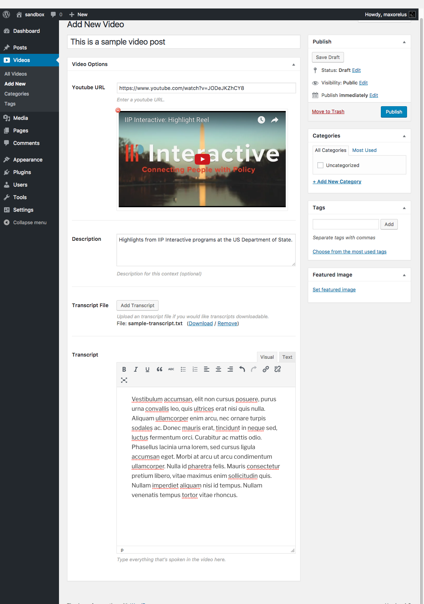

# CDP Video POst Type

* Requires at least: 3.0.1
* Tested up to: 3.4
* Stable tag: 4.3
* License: GPLv2 or later
* License URI: http://www.gnu.org/licenses/gpl-2.0.html

<!-- START doctoc generated TOC please keep comment here to allow auto update -->
<!-- DON'T EDIT THIS SECTION, INSTEAD RE-RUN doctoc TO UPDATE -->
## Table of Contents

  - [Description](#description)
  - [Interface](#interface)
  - [JSON Example](#json-example)
  - [Installation](#installation)
  - [Developers](#developers)

<!-- END doctoc generated TOC please keep comment here to allow auto update -->

## Description

CDP Video Post-Type enables you to create video content. The plugin is not publicly accessible, so a page url will not be generated for this content. It serves only to submit video content to be index into the CDP.

## Interface



## JSON Example

```json
{
  "id": 12,
  "site": "wpsandbox.dev",
  "type": "video",
  "title": "This is a sample video post",
  "slug": "this-is-a-sample-video-post",
  "published": "2017-07-13T13:11:19+00:00",
  "modified": "2017-07-13T13:11:19+00:00",
  "author": {
    "id": 1,
    "name": "maxorelus"
  },
  "categories": [
    {
      "id": 4,
      "slug": "random-category",
      "name": "Random Category"
    }
  ],
  "tags": [
    {
      "id": 5,
      "slug": "tag1",
      "name": "tag1"
    },
    {
      "id": 6,
      "slug": "tag2",
      "name": "tag2"
    },
    {
      "id": 7,
      "slug": "tag3",
      "name": "tag3"
    }
  ],
  "link": "http://wpsandbox.dev/video/this-is-a-sample-video-post/",
  "featured_image": {

  },
  "video_url": "https://www.youtube.com/watch?v=JODeJKZhCY8",
  "description": "Highlights from IIP Interactive programs at the US Department of State.",
  "transcript": "Vestibulum accumsan, elit non cursus posuere, purus urna convallis leo, quis ultrices erat nisi quis nulla. Aliquam ullamcorper enim arcu, nec ornare turpis sodales ac. Donec mauris erat, tincidunt in neque sed, luctus fermentum orci. Curabitur ac mattis odio. Phasellus lacinia urna lorem, sed cursus ligula accumsan eget. Morbi at arcu ut arcu condimentum ullamcorper. Nulla id pharetra felis. Mauris consectetur pretium libero, vitae maximus enim sollicitudin quis. Nullam imperdiet aliquam nisi id tempus. Nullam venenatis tempus tortor vitae rhoncus.",
  "transcript_file_url": "http://wpsandbox.dev/wp-content/uploads/2017/07/sample-transcript.txt"
}
```

## Installation

This section describes how to install the plugin and get it working.

1. Upload `cdp-video-post-type.php` to the `/wp-content/plugins/` directory
2. Activate the plugin through the 'Plugins' menu in WordPress
3. Place `<?php do_action('plugin_name_hook'); ?>` in your templates

```php
<?php code(); // goes in backticks ?>
```

## Developers

At the moment, the only files you should edit/modify our:

* `includes/class-cdp-video-post-type-loader.php`
* `includes/class-cdp-video-post-type-rest-controller.php`
